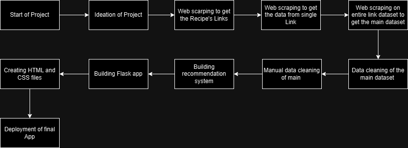

# Recipe Recommendation System
## Overview

The Recipe Recommendation System is a web-based application designed to suggest the top 5 recipes based on the ingredients provided by the user. The system uses a dataset of recipes, implements a machine learning model for recommendation, and is deployed for easy access via the web.

## Features

- Ingredient-based Recipe Suggestions: Enter ingredients to get a list of recipes.

- User-Friendly Interface: A simple and intuitive interface for users.

## Tech Stack

### Frontend

- HTML

- CSS

### Backend

- Python (Flask framework)

### Database

- No separate database is used. The system directly uses the provided dataset.

### Deployment

- The application is deployed on Render.

## Dataset

- The dataset contains cleaned and preprocessed recipes in a CSV format.

- The ingredients.txt file lists available ingredients for reference.

## Implementation Details

1. Model Training: The recommendation model is pre-trained and saved as model_n.pkl.

2. Core Logic: Implements the recommendation system using cosine similarity and machine learning techniques.

3. Integration:

    - Flask connects the frontend and backend.

    - The dataset is loaded directly for processing without additional database integration.

## Project Files

1. app.py: Main application file containing the Flask backend logic.

2. res_Recommendation_system.ipynb: Notebook for preprocessing the dataset and training the model.

3. cleaned_recipes(Final_Dataset).csv: Final dataset used for recommendations.

4. ingredients.txt: List of available ingredients for reference.

5. model_n.pkl: Pickle file containing the trained recommendation model.

## Flow of Project

## Demo Video
[Demo Video](images/demo video(1).mp4)
